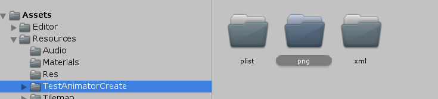
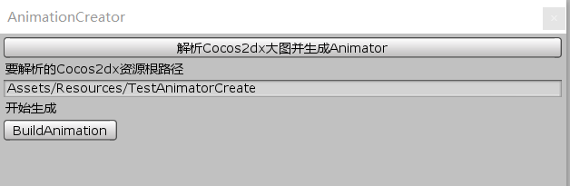
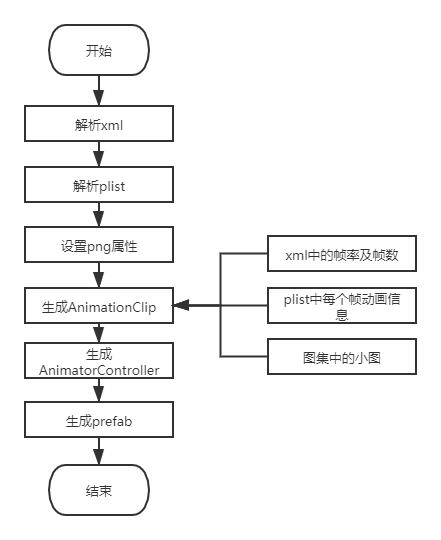

## 简介
AnimatorCreator是一款Unity编辑器插件。针对Cocos2dx帧动画资源无法直接在Unity中使用，需要重新制作帧动画资源的现状。为了减少重复制作资源的工作量，故设计一款Unity插件，使用Cocos2dx资源自动生成Unity所需帧动画资源，解决上述问题。

## 如何使用
 - 将cocos2dx帧动画资源 plist文件, png文件, xml文件分成三个文件夹。如图：

   其中plist文件后缀需改为txt

 - 右键点击TestAnimatorCreate -> BuildAnimation -> ParseCocosToAnimation
 - 点击BuildAnimation，如图：
  

 - 创建完成后在资源同目录生成Animation、Controller、prefab

- 详情可见TestCreator

## 目前支持
Cocos2dx plist帧动画 format=2, 3的解析

## 实现流程

